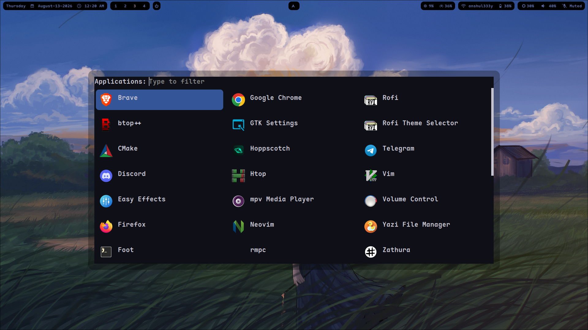
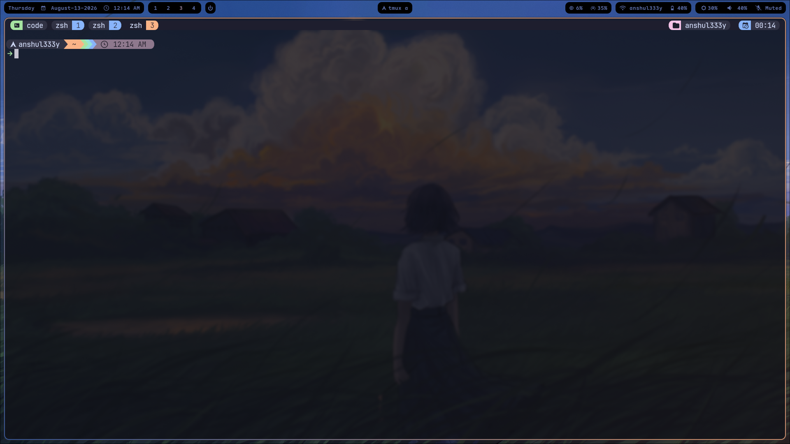
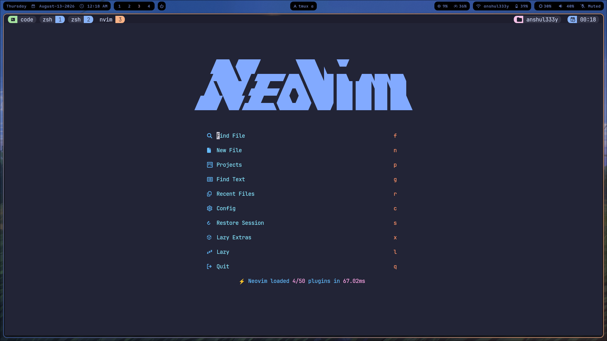

Personal dotfiles for **Arch Linux + Hyprland**.


## Table of Contents

- [Preview](#preview)
- [Structure](#structure)
- [Terminal](#terminal)
- [Key Hyprland Binds](#key-hyprland-binds)
- [Installation](#installation)
- [Notes](#notes)

## Preview

<table>
  <tr>
    <td align="center">
      <br/>
      <sub>Desktop</sub>
    </td>
    <td align="center">
      <br/>
      <sub>Rofi Launcher</sub>
    </td>
  </tr>
  <tr>
    <td align="center">
      <br/>
      <sub>Terminal</sub>
    </td>
    <td align="center">
      <br/>
      <sub>Neovim</sub>
    </td>
  </tr>
</table>

## Structure

```
.config/
├── hypr/           Hyprland config (Lua), hyprlock, hyprpaper, hypridle
├── foot/           Terminal emulator
├── waybar/         Status bar
├── rofi/           App launcher / menu
├── dunst/          Notifications
├── wlogout/        Logout / power menu
├── zsh/            Shell config
├── starship/       Shell prompt
├── nvim/           Neovim
├── vim/            Vim (fallback)
├── tmux/           Terminal multiplexer
├── git/            Git config
├── wal/            Pywal color theming
├── zathura/        PDF viewer
├── nsxiv/          Image viewer
├── ncmpcpp/ mpd/ rmpc/   Music (MPD + clients)
├── fontconfig/     Font configuration
├── nix/ nixos/     Nix config (kept for reference / other machines)
├── x11/            X11 fallback settings
├── npm/ wget/      Misc CLI tool configs
├── systemd/        User systemd units
├── custom/         gnome.dconf, user.js (Firefox tweaks)
└── mimeapps.list   Default application associations

.local/share/
├── applications/   Custom .desktop entries
└── icons/dunst/    Notification icons

.face               Profile picture (used by some login/display managers)
```

## Terminal

**foot** is the terminal emulator used throughout. In `hypr/custom/env.lua`:

- `Terminal = "footclient"` — bound to `Super + Return`
- `foot --server` is launched on Hyprland startup (daemon mode, so new windows spawn instantly via `footclient`)
- `FileManager = "foot -e yazi"` — the file manager (yazi) also runs inside foot

## Key Hyprland Binds

A selected subset from `hypr/custom/keys.lua` — see that file for the full list.

| Bind                    | Action                        |
| ----------------------- | ----------------------------- |
| `Super + Return`        | Open terminal (foot)          |
| `Super + Space`         | App launcher (rofi)           |
| `Super + E`             | File manager (yazi in foot)   |
| `Super + F` / `G` / `B` | Firefox / Chrome / Brave      |
| `Super + C`             | VS Code                       |
| `Super + W`             | Toggle waybar                 |
| `Super + Shift + L`     | Lock screen (hyprlock)        |
| `Super + F4`            | Power menu (wlogout)          |
| `Print`                 | Screenshot, region (hyprshot) |

## Installation

> ⚠️ `stow .` will refuse to run (with a conflict error) if any target file already exists at the same path in your home directory and isn't already a symlink to this repo. Move or remove conflicting files first, or back up `~/.config` before proceeding.

1. Install dependencies:

   `hyprland foot waybar rofi dunst wlogout zsh starship neovim tmux git python-pywal zathura nsxiv mpd ncmpcpp yazi stow`

2. Clone this repo as `~/.dots` and symlink everything into place with [GNU Stow](https://www.gnu.org/software/stow/). This symlinks `.config/*`, `.local/*`, and `.face` from the repo into `~/` (to remove the symlinks later, run `stow -D .`):

   ```bash
   git clone https://github.com/anshul333y/.dots.git ~/.dots
   cd ~/.dots
   stow .
   ```

3. Set zsh as your login shell if desired: `chsh -s $(which zsh)`.

4. Log into a Hyprland session — `hypr/custom/env.lua` starts `foot --server` automatically.

## Notes

- `hypr/` uses a Lua-based config; `custom/*.lua` is the single source of truth for keybinds, env vars, and window rules.
